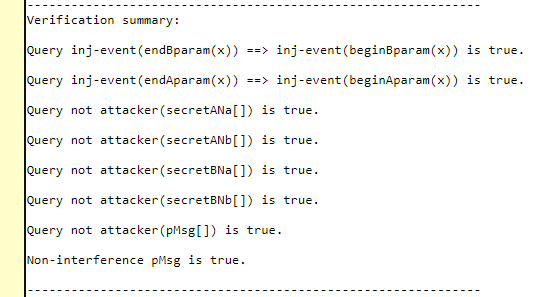

# Cryptographic Protocols Project

📌 For the subject of Cryptographic Protocols, we have to use ProVerif to verify security properties of one protocol

## Oct 30
* It is from one of the properties, Authentication and Confidentiality
* First differentiate between these two.
* Look at the sample code in the manual for an idea.
* Check the chosen paper for code.
* We will try to verify confidentiality as it is given in the paper already

## Oct 31

Found some papers that have code
*  [For KDC + other](https://hal.science/hal-01689790/document) or [alternate link](https://sancy.iut.uca.fr/~lafourcade/PAPERS/PDF/BLGR17.pdf)
*  [Papers using ProVerif](https://bblanche.gitlabpages.inria.fr/proverif/proverif-users.html)
*  [ProVerif online demo](http://proverif20.paris.inria.fr/index.php)
*  [Maybe useful](https://journalofcloudcomputing.springeropen.com/articles/10.1186/s13677-023-00464-0)

Realized, I just have to add Needham–Schroeder protocol to the paper

📆 Project date: Dec 5

🛒 Things to prepare

- One summary report. Min 6 pages - Description, security property we chose, process of Proverif and Output
- Raw code
- Presentation slides

## Final update
I was able to verify the security properties - Confidentiality and Authentication of the CP-ABE scheme implemented along with the Needham-Schroeder public-key protocol.

According to NIST:
- 'Confidentiality' means preserving authorized restrictions on access and disclosure, including means for protecting personal privacy and proprietary information.
- 'Authentication' refers to the process of verifying the identity of a user, process, or device, often as a prerequisite to allowing access to resources in an information system.

### 📎 Paper: Security Verification of Key Exchange in Ciphertext-Policy Attribute Based Encryption

**Citation**: B. Bat-Erdene, Y. Yan, M. B. M. Kamel and P. Ligeti, "Security Verification of Key Exchange in Ciphertext-Policy Attribute Based Encryption," 2022 7th International Conference on Signal and Image Processing (ICSIP), Suzhou, China, 2022, pp. 377-381, doi: [10.1109/ICSIP55141.2022.9887218](https://doi.org/10.1109/ICSIP55141.2022.9887218).

- The code was written in ProVerif.
- The files along with a summary report and presentation are in the directory.

### Output

